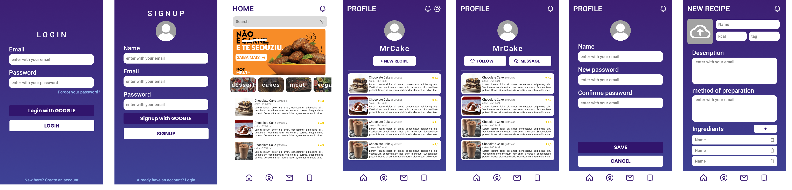
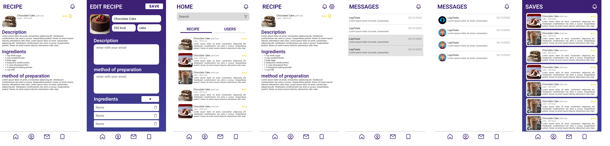

# Nome do Projeto

Recipe é uma plataforma mobile para vizualizar e ranquear receitas e pratos.

### Interface do projeto



## Tecnologias do projeto:
   - Front end: React Native, Typescript, Axios,React Navigation.
   - Back end: PostgreSQL, NodeJs, NestJS, PrismaORM, Docker, Docker-compose, Joi, Jest.

## Pontos de atenção:
   Esse projeto foi feito com o intuito de estudar Arquitetura de software, Design Patterns e Boas práticas de Programação. Das funcionalidades mais interessantes do projeto eu resalto:
   - Sistema de chat em tempo real
   - Sistema de notificações em tempo real
   - Otimização de banco de dados através de consultas limpas
   - Otimização de banco de dados através de Indexes
   - Sistema de autenticação com JWT
   - Upload de imagem da galeria do celular, com salvamento no proprio servidor

## Pré-requisitos

Antes de iniciar o projeto, verifique se você possui os seguintes requisitos instalados:

- **Docker** - para a criação e gerenciamento de containers.
- **ADB (Android Debug Bridge)** - necessário para depuração e desenvolvimento em dispositivos Android.
- **NodeJS** - ambiente de execução JavaScript para o desenvolvimento backend e execução de scripts.

## instalação
1. Clone este repositório:
   ```bash
   git clone https://github.com/seu-usuario/nome-do-projeto.git
    ```

## Dependencias Back-end
1. Acesse a pasta do projeto:
    ```bash
      cd /recipe/server
    ```
2. Instale as dependências:
    ```bash
      npm install
    ```
## Dependencias Front-end
1. Acesse a pasta do projeto:
    ```bash
      cd /recipe/client
    ```
2. Instale as dependências:
  ```bash
npm install
  ```

## Executando o Projeto
Para executar o projeto, você deverá ter 3 bash abertos: um para executar o client, outro para executar a API Restfull, e um ultimo para executar o banco de dados Postgress.

### Primeiro Bash
1. Abra um bash em `/recipe/server`:
    ```bash
      cd /recipe/server
    ```
2. Comece rodando o banco de dados:
    ```bash
      sudo docker compose up
    ```
### Segundo Bash
1. Abra um bash em `/recipe/server`:
    ```bash
      cd /recipe/server
    ```
2. Crie uma cópia do arquivo `.env.example` na raiz da pasta `recipe/server` com o nome de `.env`:
    ```bash
    cp .env.example .env
      ```
3. crie o client Prisma para trabalhar com o banco de dados:
     ```bash
     npx prisma generate
     ```
4. Rode as migrations para criar tabelas e colunas do banco de dados:
   ```bash
   npx prisma migrate dev
   ```
5. Execute a API Restfull:
    ```bash
   npm run start:dev
   ```
### Terceiro Bash
  1. Abra um bash em `/recipe/client`:
  ```bash
    cd /recipe/client
  ```
  2. Execute a aplicação no android:
  ```bash
    npm run android
  ```
